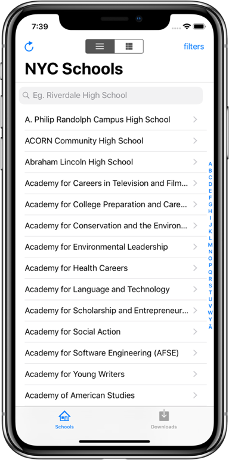
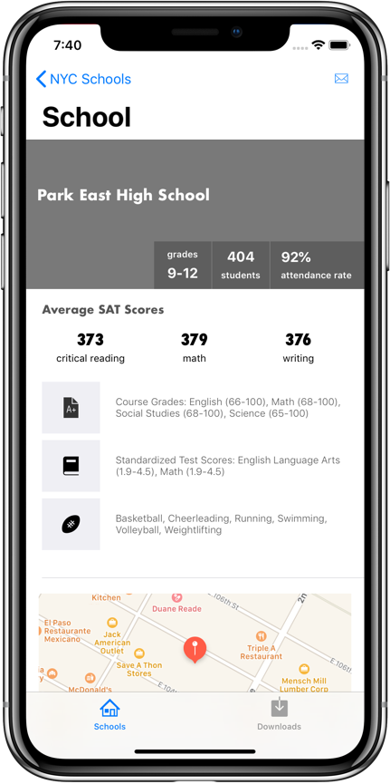
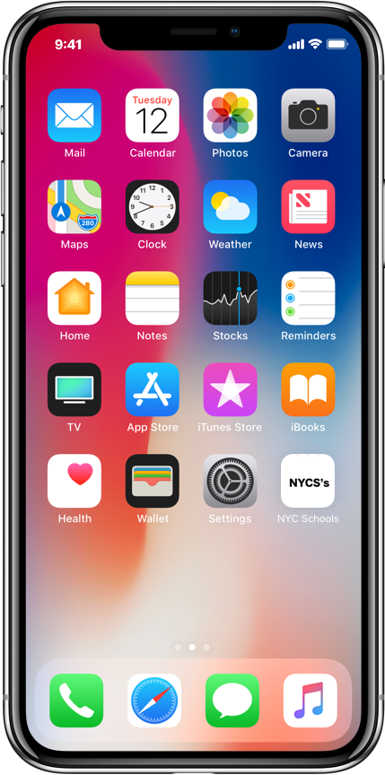

# New York City Schools (NYSCSchools)

A simple CoreData app to show a list of NYC schools and their SAT scores. Comsumes the NYC Open data API.

## What I've learned from building this project

* CoreData. Modelling object with the object graph. NSManagedObject. NSManagedObjectContext. Generating Subclasses manually and automatically. Loading Managed object using Codable objects from parsed API fetches. Creating custom initializers in ManagedObject classes. NSFetchRequests. BatchDeletes. Inserting Entities. Performance. Using NSFetchedResultController to load data from the context. 
* Mapkit. Show locations on a mapkit. Use annotation. Deep link to Google maps. 
* Notifications. Post local notifications on app to sycn download data
* Search. use searchResultController with NSFetschResultController
* Accessibility. Use sectionIndexTitle to display large amount of tableViewCells

## Features

* Search schools by name
* Filter schools based on SAT scores 
* Sort schools by attendance rate and population 
* Refresh data by re-downloading from remote server
* View download history
* Open location in Google maps through deep linking 
* Alerts and notifications
* View downloaded data using SQL tool

   

## Some challenges I encountered

For the filters feature, there has to be communication with the home screen once the filters are applied so that the schools can be reloaded. The problem here is the School and SAT are two separate classes. This could be solved by creating a relationship between school and SAT scores, however they both come from different API and there is no guarantee there will be match. In addition, there would be a cost to sort and match them using a dictionary upon loading the first time, and some data may be lost in the process. So to return the filtered score and use them to find the schools I had to use compound predicate of the filtered scores, then give this to the fetchResultController (FRC) for the school which can be sorted by attendance rate or class size. Another solution is to use two FRC but I want to consider simplicity and code redability.

The other problem I encountered was syching the API downloads with loading to coreData. Since both tasks are performed on different threads I had to use asyn request or perform and wait after the two api calls are made. The problelm here this can not be delay when appDelegate is loading because iOS can terminate the app if it takes too long. What it caused was the home screen will load before the data is downloaded. So I used notification here to notofy the app once the data is downloaded and loaded to coredata. Then the home screen tableview can be reloaded with an alert

## Installing

Just the normal way. no additional things needed. Build on XCode or your iphone

## Api Source

- [NYC Schools] - https://data.cityofnewyork.us/Education/DOE-High-School-Directory-2017/s3k6-pzi2
- [SAT Scores] - https://data.cityofnewyork.us/Education/SAT-Results/f9bf-2cp4

---
I can build an app for you. Contact me.

> LinkedIn [Chidi Emeh](https://www.linkedin.com/in/chidi-emeh-2307359a/) &nbsp;&middot;&nbsp;
> Youtube [Chillybean](https://www.youtube.com/channel/UC4gJhJti278cbnlkntvX79Q) &nbsp;&middot;&nbsp;
> Twitter [@chidiemeh184](https://twitter.com/chidiemeh184)
